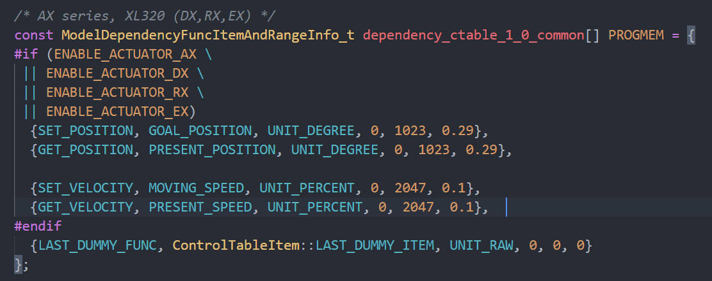

# PE46

## Config

> **Code** 
> const float DXL_PROTOCOL_VERSION = 1.0;
> baudrate : 1000000




From the codes,we can know the parametre when we ues `Function`,for example:

```C++
Dynamixel2Arduino.setGoalPosition(dxl_ID,goal,UNIT_DEGREE)
// the parameter of velocity is same as above
```


## Quickly learn and use

**Attention** : ==don’t change the model of the code==

### model of code

```C++
// this file is in the same root of main.cpp
#include <Arduino.h>
#include "led.h"
#include <Dynamixel2Arduino.h>

/* configure for Arduino Board */
#include <SoftwareSerial.h>
SoftwareSerial soft_serial(7, 8); // DYNAMIXELShield UART RX/TX
#define DXL_SERIAL Serial
#define DEBUG_SERIAL soft_serial
const int DXL_DIR_PIN = 2; // DYNAMIXEL Shield DIR PIN

// Baudrate 1000000
const uint8_t DXL_ID = 11;
const float DXL_PROTOCOL_VERSION = 1.0; // important

/* installize led */
myLED led(LED_BUILTIN);

Dynamixel2Arduino dxl(DXL_SERIAL, DXL_DIR_PIN);

// This namespace is required to use Control table item names
using namespace ControlTableItem;

void setup()
{
  DEBUG_SERIAL.begin(115200);
  while (!DEBUG_SERIAL)
    ;

  dxl.begin(1000000);
  dxl.setPortProtocolVersion(DXL_PROTOCOL_VERSION);
 /* add you codes here */
}

void loop()
{
/* add your codes here */
}

```


